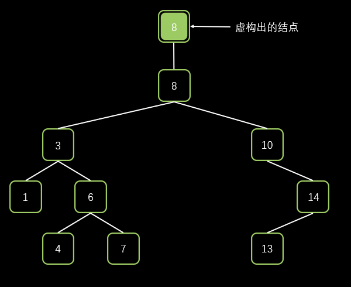

# [1026. Maximum Difference Between Node and Ancestor](https://leetcode.cn/problems/maximum-difference-between-node-and-ancestor)

Given the `root` of a binary tree, find the maximum value `v` for which there exist **different** nodes `a` and `b` where `v = |a.val - b.val|` and `a` is an ancestor of `b`.

A node `a` is an ancestor of `b` if either: any child of `a` is equal to `b` or any child of `a` is an ancestor of `b`.

 

**Example 1:**


```
Input: root = [8,3,10,1,6,null,14,null,null,4,7,13]
Output: 7
Explanation: We have various ancestor-node differences, some of which are given below :
|8 - 3| = 5
|3 - 7| = 4
|8 - 1| = 7
|10 - 13| = 3
Among all possible differences, the maximum value of 7 is obtained by |8 - 1| = 7.
```

**Example 2:**


```
Input: root = [1,null,2,null,0,3]
Output: 3
```

 

**Constraints:**

- The number of nodes in the tree is in the range `[2, 5000]`.
- `0 <= Node.val <= 105`


## 解法一：深度优先搜索（DFS）

首先我们可以逆向思维，不一定是 `祖先.val - 子代.val` ，我们可以 `子代.val - 祖先.val`。

我们想一下，要求这棵树的节点与其祖先之间的最大差值，我们可以先求出该节点的**左子树的节点与其祖先之间的最大差值**，和**右子树的节点与其祖先之间的最大差值**，再求出自己与祖先之间的最大差值，三者求出最大值，返回即可。所以我们还需要两个变量来记录祖先的最大值和最小值。

```java
int dfs(TreeNode node, int max, int min)
```

- **node** 代表当前在遍历的结点
- **max** 代表当前 **node** 的所有祖先的最大值
- **min** 代表当前 **node** 的所有祖先的最小值

退出条件为

```java
if (node == null) return 0;
```

这里 return 一个 `<= 0` 的数都没有关系，不影响最终结果。

你可能会问，如果是这样的话这个算法的头节点不是没有祖先节点吗？

这里我们可以虚构出一个头结点的祖先节点（值就是它本身，也必须是它本身，这样才不会影响正确结果）以保证算法的正确性，然后调用 `dfs(root, root.val, root.val)` 去搜索节点为 `root` 的树，显然，最开始 `root` 节点的祖先的最大值和最小值都是它自己。

例如：`root = [8,3,10,1,6,null,14,null,null,4,7,13]`



所以完整代码如下

```java
class Solution {
    public int maxAncestorDiff(TreeNode root) {
        return dfs(root, root.val, root.val);
    }

    private int dfs(TreeNode node, int max, int min) {
        if (node == null) return 0;
        max = Math.max(max, node.val);
        min = Math.min(min, node.val);
        int maxLeft = dfs(node.left, max, min);
        int maxRight = dfs(node.right, max, min);
        int maxSelf = Math.max(Math.abs(node.val - max), Math.abs(node.val - min));
        return Math.max(Math.max(maxLeft, maxRight), maxSelf);
    }
}
```

