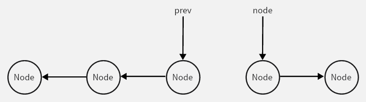
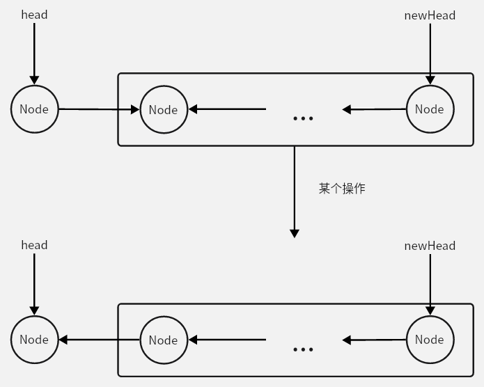

# [206.Reverse Linked List](https://leetcode.cn/problems/reverse-linked-list)

## 题目

Given the `head` of a singly linked list, reverse the list, and return *the reversed list*.

**Example 1:**


```
Input: head = [1,2,3,4,5]
Output: [5,4,3,2,1]
```

**Example 2:**


```
Input: head = [1,2]
Output: [2,1]
```

**Example 3:**

```
Input: head = []
Output: []
```

**Constraints:**

- The number of nodes in the list is the range `[0, 5000]`.
- `-5000 <= Node.val <= 5000`


## 解法一：迭代

需要用到两个“指针”来遍历链表，分别是

- `node` 当前需要反转的结点

- `prev` 当前需要反转的结点的前一个结点

首先我们来看一张图



这里我们要把  `node` 结点进行反转，该怎么办？

1. 先用变量存入 `node.next`（防止第 2 步清除了 `node` 原来的 `next`）

   ```java
   ListNode nextNode = node.next;
   ```

2. 将 `node` 指向的结点指向前一个结点

   ```java
   node.next = prev;
   ```

   上述两步已经将 `node` 结点反转了，为了让迭代继续，我们应该将它们都往后移动一个结点（即第 3 步）

3. 将两个“指针”都往后移动一个结点

   ```
   prev = node;
   node = nextNode;
   ```


完整代码如下

```java
class Solution {
    public ListNode reverseList(ListNode head) {
        ListNode prev = null, node = head;
        while (node != null) {
            ListNode nextNode = node.next;
            node.next = prev;
            prev = node;
            node = nextNode;
        }
        return prev;
    }
}
```

> 时间复杂度：$O(n)$
>
> 空间复杂度：$O(1)$


## 解法二：递归⭐

**递归首先就要明确的是，我们这个递归函数是用来做什么的。**

在这里，我们的递归函数 `reverseList(ListNode head)` 是将一个头结点为 `head` 的链表反转过来，**并且返回新链表的头结点**，我们把它抽象出来，即不用管内部怎么实现的，我们只要知道调用这个函数就会让传入的链表反转过来。

现在我们要有一个递归公式，**描述  $f(n) $ 与  $f(n - 1)$  的关系**。本题的关系为：

$反转头结点为 head 的链表 = 反转头结点为 head.next 的链表+某个操作$

这里的某个操作就是让 `head` 结点与 `head.next` 链表连接起来。

### 

所以我们在这里写出这个操作的代码实现

```java
head.next.next = head;
head.next = null;
```

那么将 `f(n)` 与 `f(n - 1)` 的公式完整的写出来就是

```java
// 先将 head.next 指向的链表反转，用一个变量存储反转后的头结点（用于后面返回）
ListNode newHead = reverseList(head.next);
// 某个操作
head.next.next = head;
head.next = null;
```

**再加上出递归的条件（重点！！需要理解）**

当我们一层层进入递归的时候，我们发现当 head 指向链表尾部的结点时候，其本身就可以当作一个被反转的链表，所以当 `head.next == null` 的时候，我们就可以直接返回这个 `head`，因为这个 `head` 所指向的链表已经被反转。

**相当于递归现在进行到最底层了，即 $f(0)$ ，我们要给出 $f(0)$ 这个信息，用来递推上面的 $f(n)$。**

```
if (head == null || head.next == null) return head;
```

这里加上 `head == null` 是为了防止题中的链表传入空引用（即 `null`）从而导致的错误。


所以完整代码如下

```java
class Solution {
    public ListNode reverseList(ListNode head) {
        if (head == null || head.next == null) return head;
        ListNode newHead = reverseList(head.next);
        head.next.next = head;
        head.next = null;
        return newHead;
    }
}
```

> 时间复杂度：$O(n)$
>
> 空间复杂度：$O (n)$

其中空间开销主要在递归调用的栈空间上，最多为 n 层